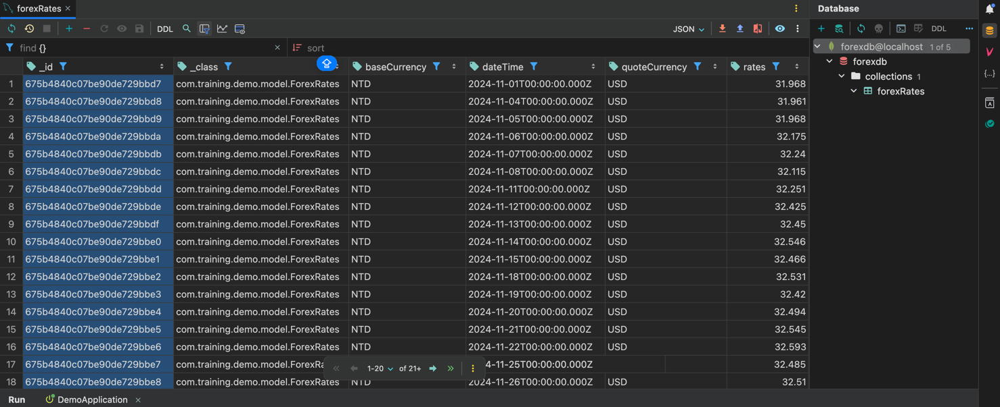
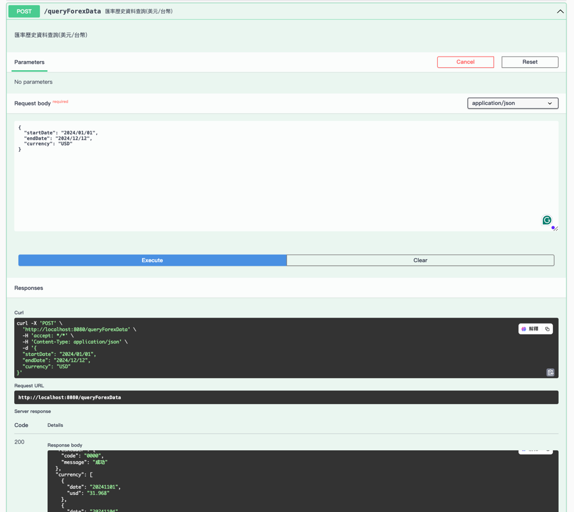
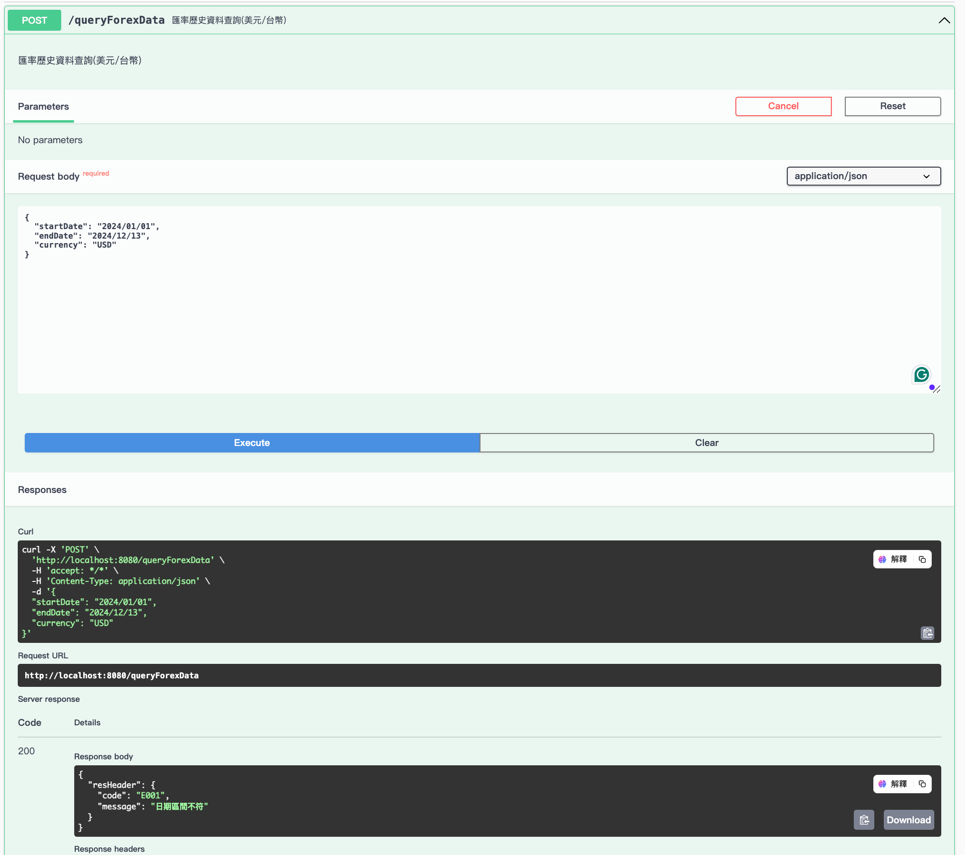
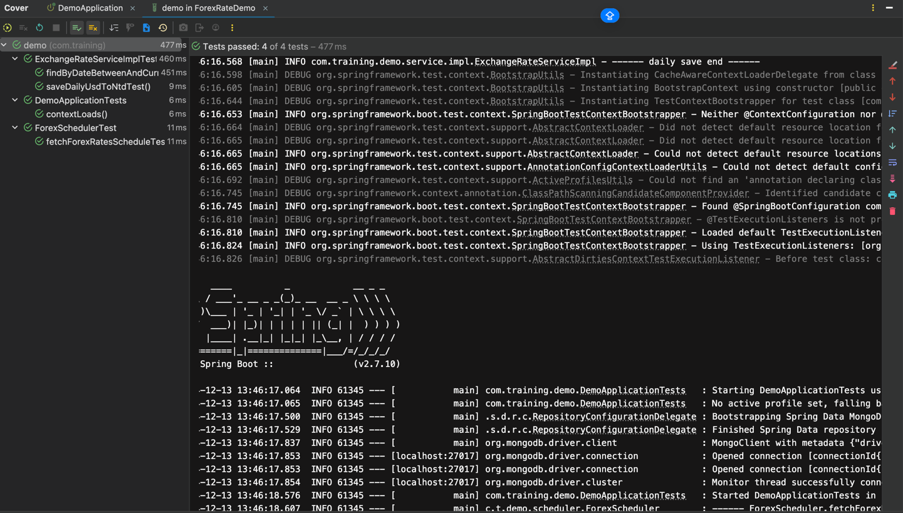

## 專案簡介
本專案使用 Spring Boot、MongoDB 和 JUnit5 實現了一個外匯資料的獲取、儲存和查詢功能。

----

#### 專案的主要功能包括： 
1. 每日批次任務： 定時從台灣期貨交易所的 API 獲取每日外匯成交資料，並將 USD/NTD 的匯率和日期存入 MongoDB 資料庫。
2. 匯率歷史資料查詢 API： 提供一個 POST API，允許使用者查詢指定日期區間內的 USD/NTD 歷史匯率。

----

#### 測試結果
1. 每日USD/NTD 匯率資料儲存

2. 匯率歷史資料查詢 API (成功)

3. 匯率歷史資料查詢 API (失敗)

4. Unit Test (成功)

